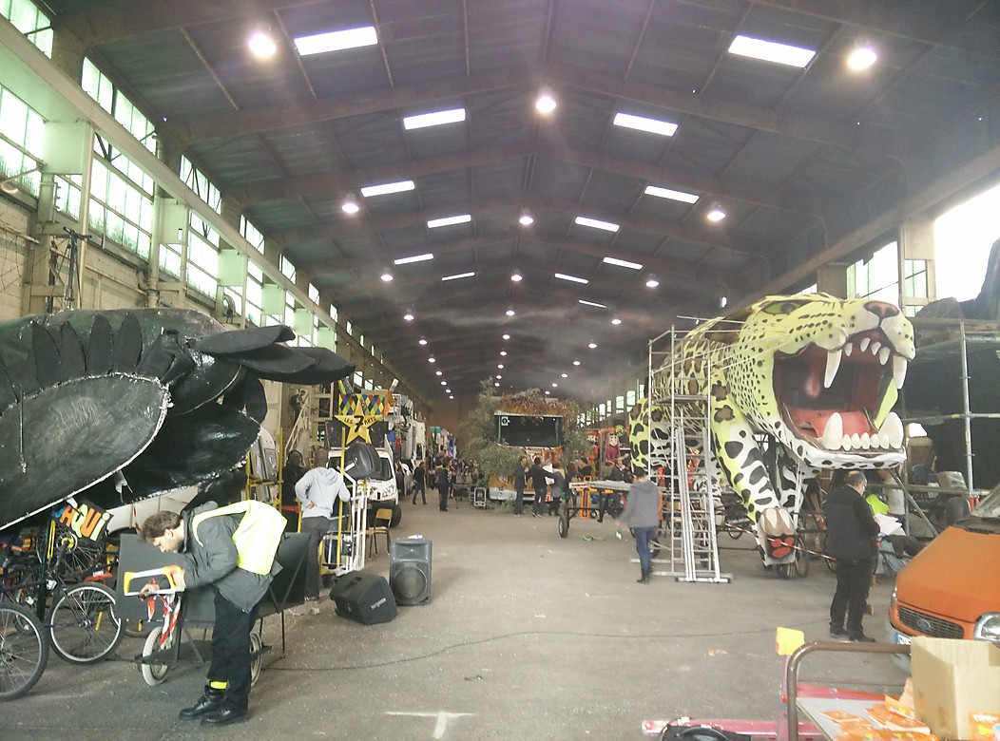
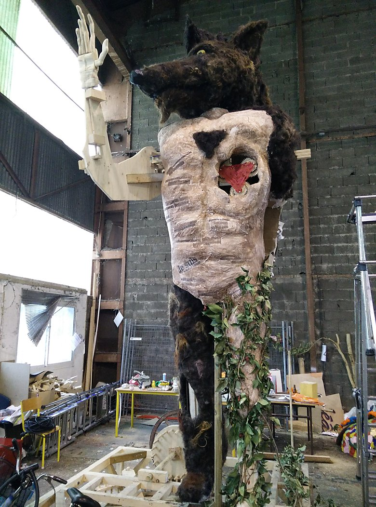
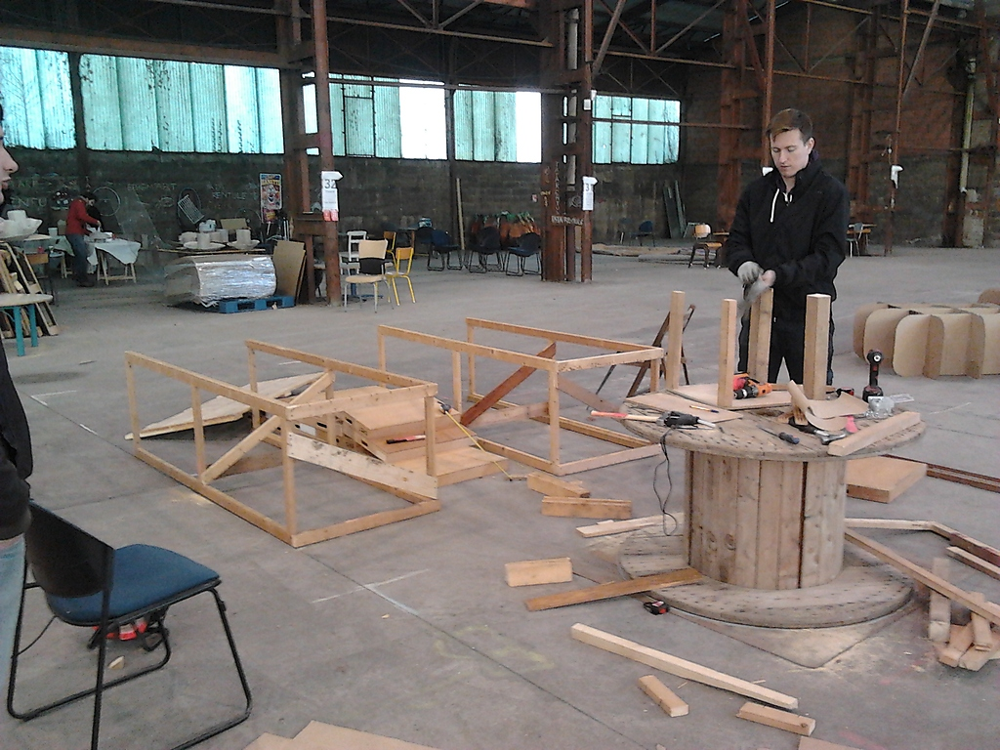
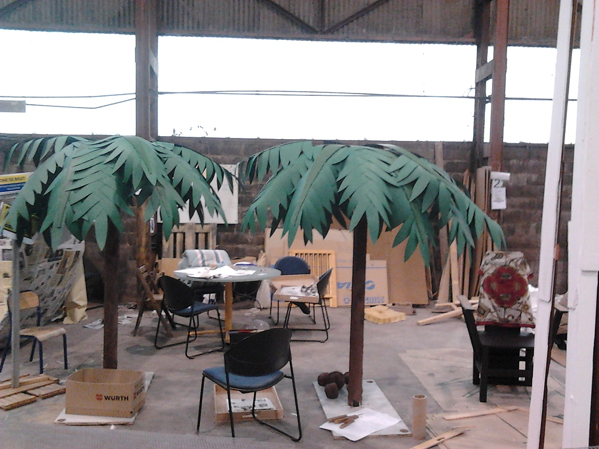
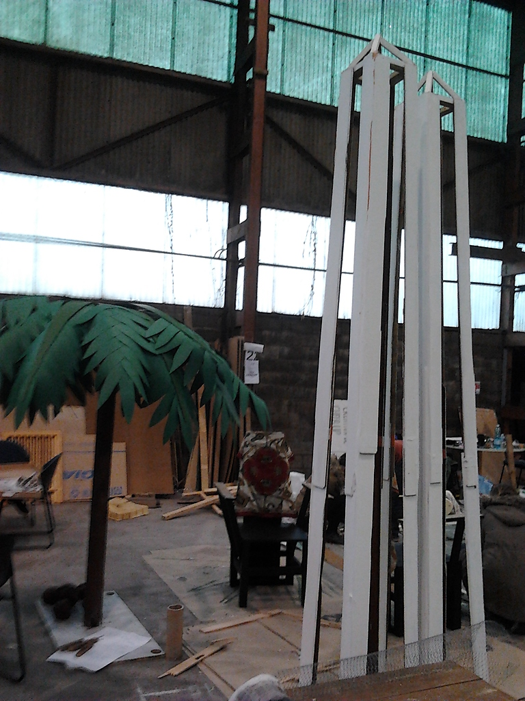
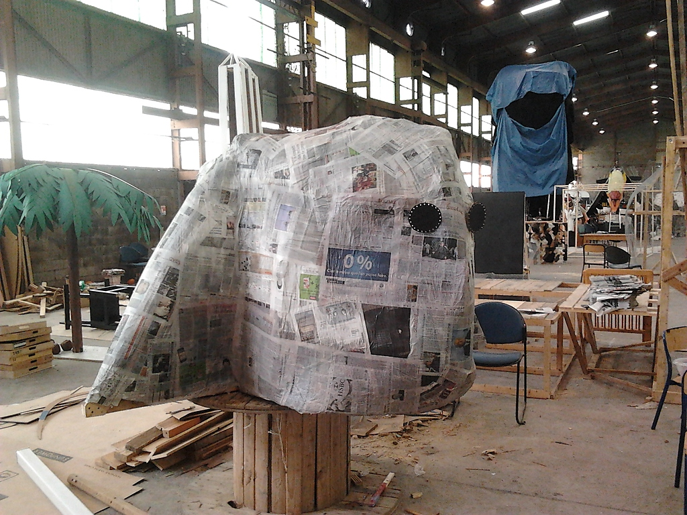
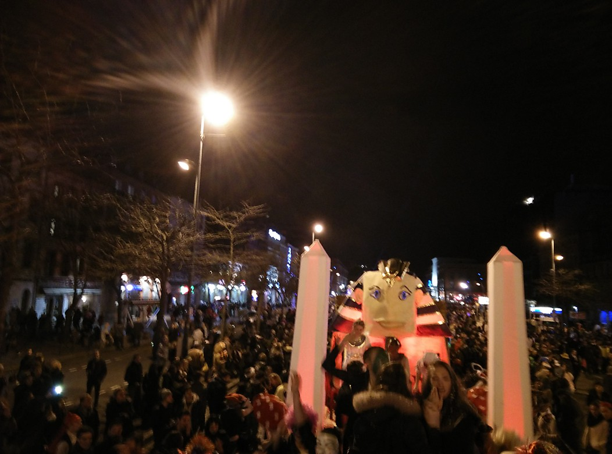
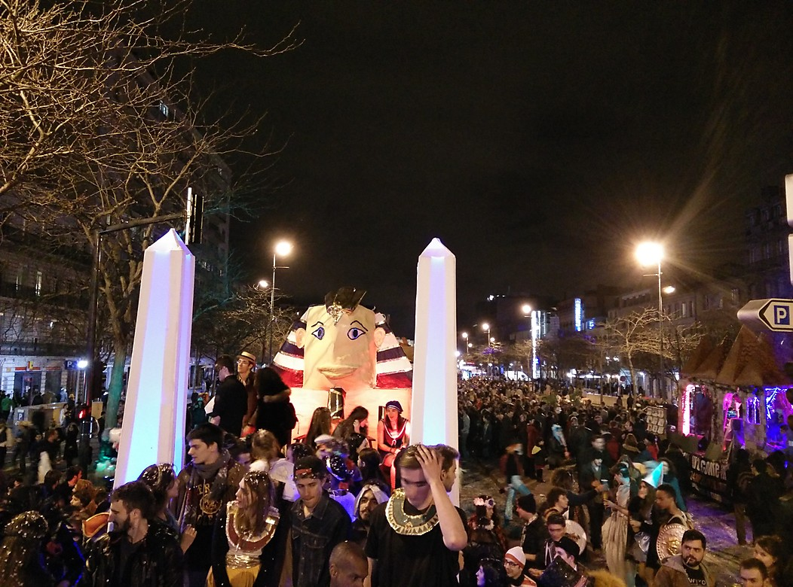

The carnival of Toulouse has for a long time been the most important student event in France. Historically, students used to burn the *king carnival* in the streets of Toulouse since the 14th century. This festive tradition disappeared in the '90s, but came back in 2010 thanks to a grouping of associations.

In 2013, students from INP engineering schools gathered to form the *Carnaval INP* association and take part in these memorable parades — gathering more than **100,000** marvelled cheering people every year.

