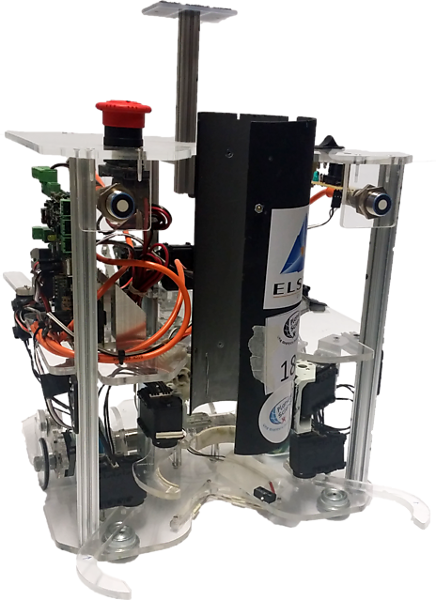
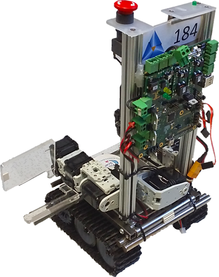
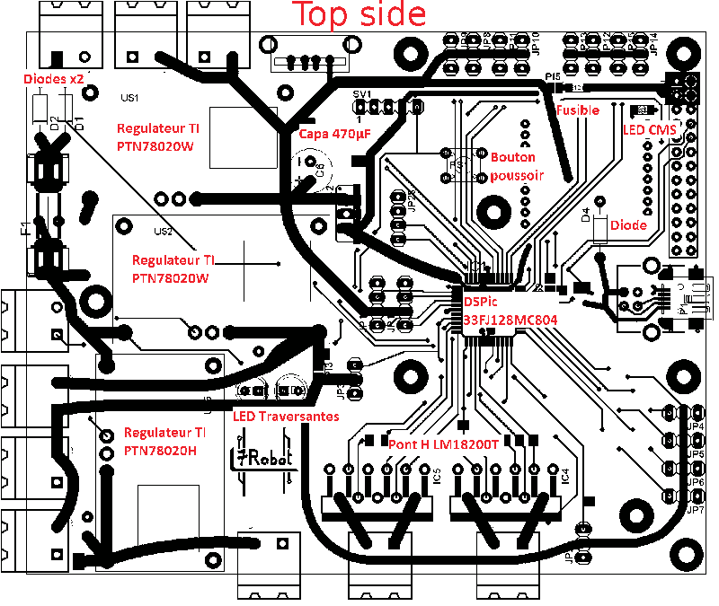
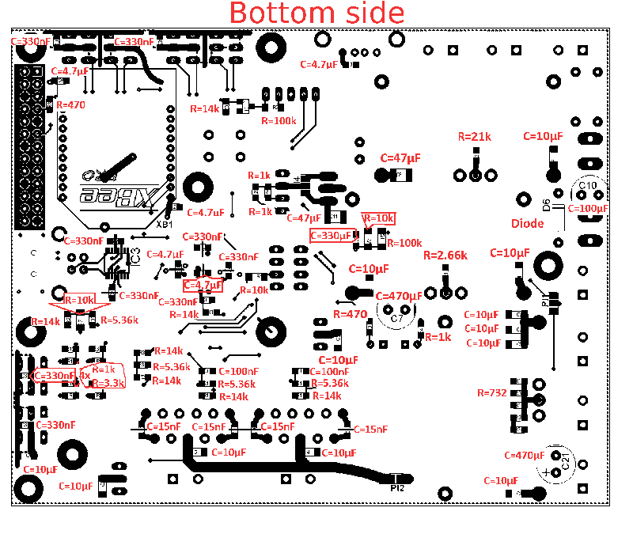
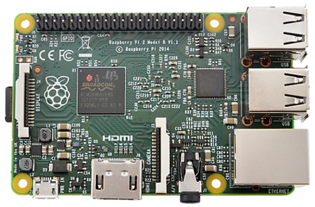

The French Robotics Cup is a fun, scientific and technical robotics challenge intended for teams of young robotics lovers, or for associations with educative projects towards young people.

This event allows a lot of knowledge and skill exchange between the challengers. Each team has to design at least one autonomous robot according to the rules and the competition's fair play. Challengers can be assisted by a teacher, but the design and realisation of the robots must be the product of their personal reflection.

Every year, a team of students from 7Robot, the ENSEEIHT robotics club, takes part in the event. In 2015 I was president of this club, and after 8 months of intense team working we managed to reach the **5th national position** ahead of more than **180 teams**, being **quarter-finalists** of the French Robotics Cup.

Each occasion of the event has its own funny theme that gives a figurative sense to the robots' actions. This time, the theme was *RoboMovies*, so the robots had to close cinema clapperboards, build spotlights, grab popcorn, climb the famous steps of the Cannes Film Festival… Here is the robotic cast from 7Robot, featuring Hitchbot and Tarantibot from left to right:

For this year, we decided to gather all the electronic functions on a single board, identical for Hitchbot and Tarantibot to make maintenance easier, but with a different embedded code. To achieve this, the following components have been united on the board:

- Texas Instruments step-down integrated switching regulators for various tension requirements
- Microchip PIC microcontroller for control loops, sensors and actuators
- LM18200T H-bridges for motor control

Intelligence — [Raspberry Pi 2](https://www.raspberrypi.org/products/raspberry-pi-2-model-b/):

A video from the cup, with Hitchbot and Tarantibot in the foreground and SpaceCrackers — another team from Toulouse — in the background:

<video controls poster="/img/frenchroboticscup/logosimple.png">
  <source src="/img/frenchroboticscup/7RobotSpaceCrackers.webm" type="video/webm" />
  Your browser does not support the video tag.
</video>
