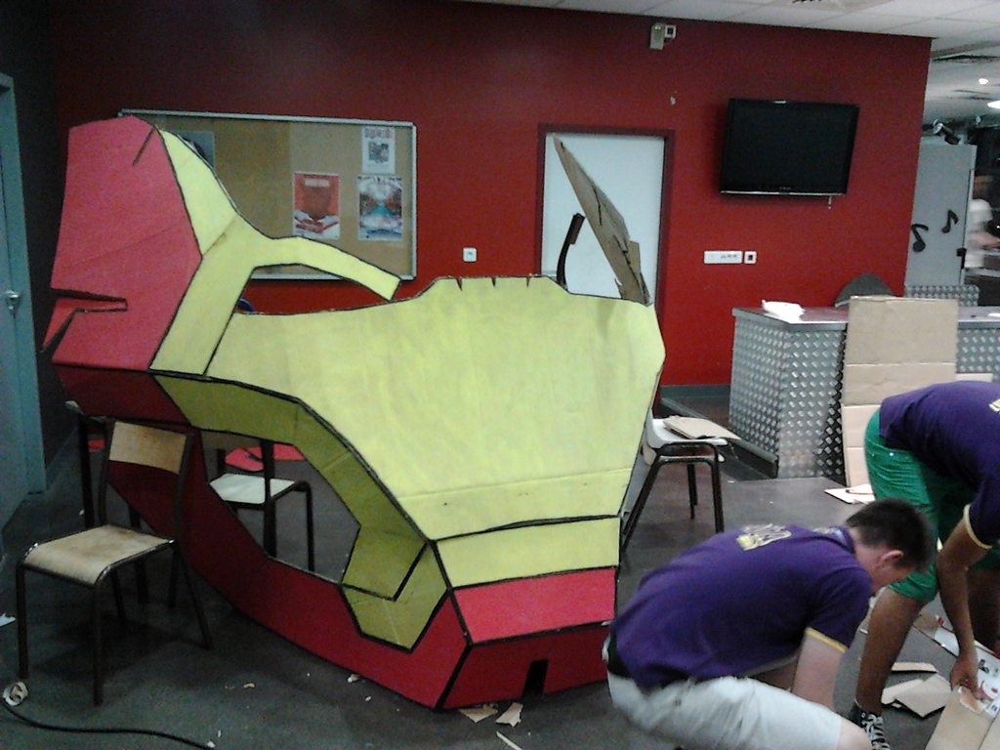
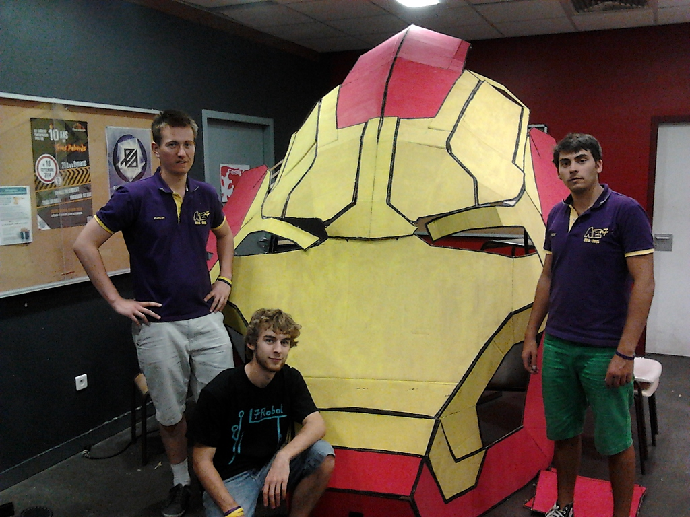
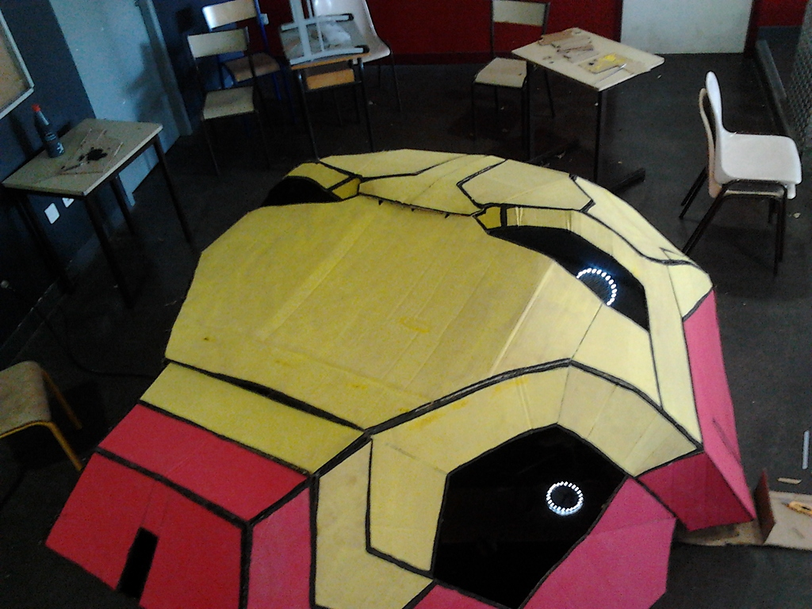
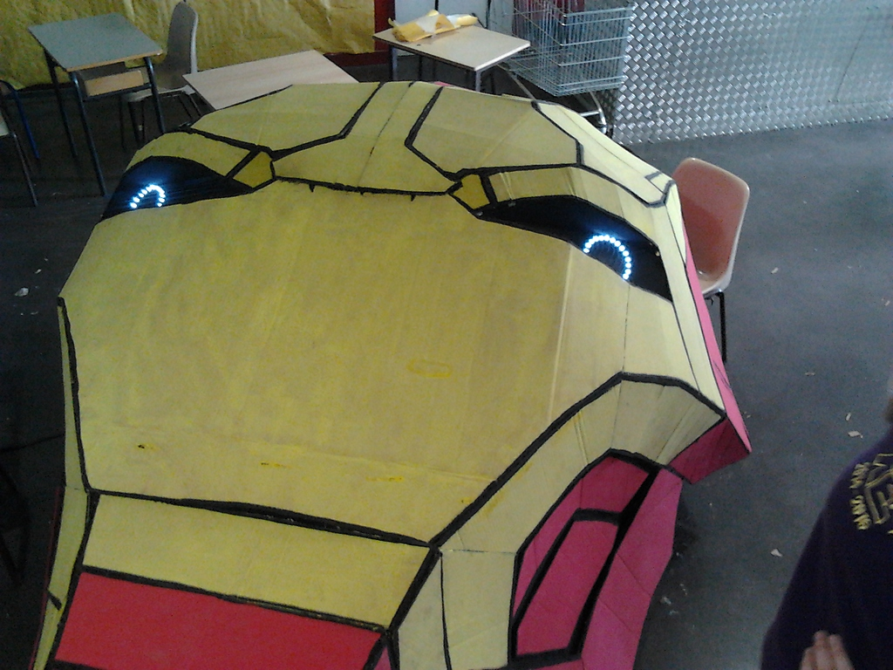
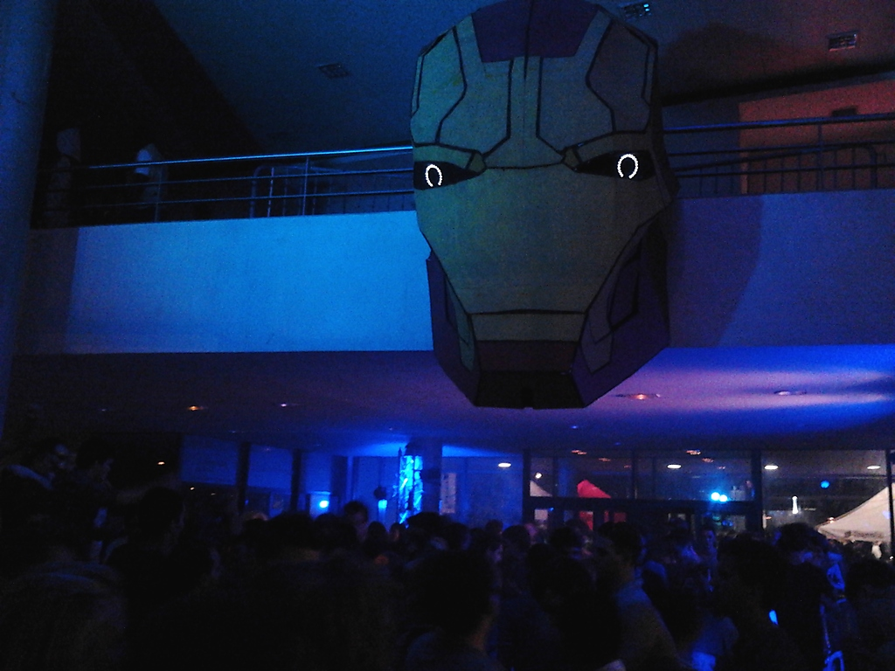
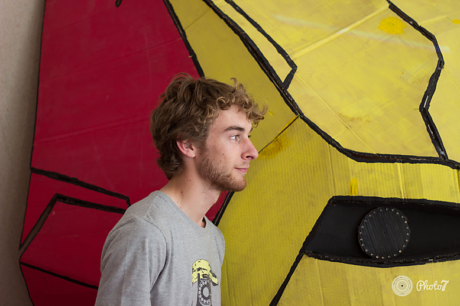
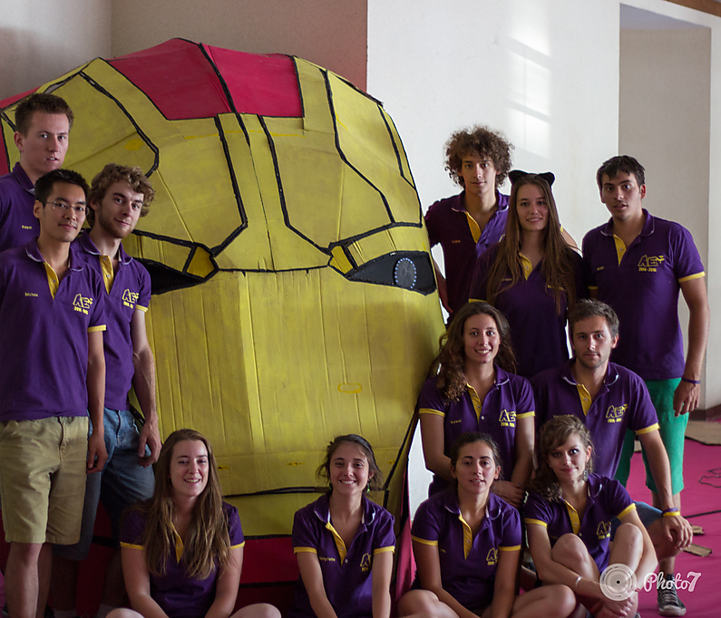
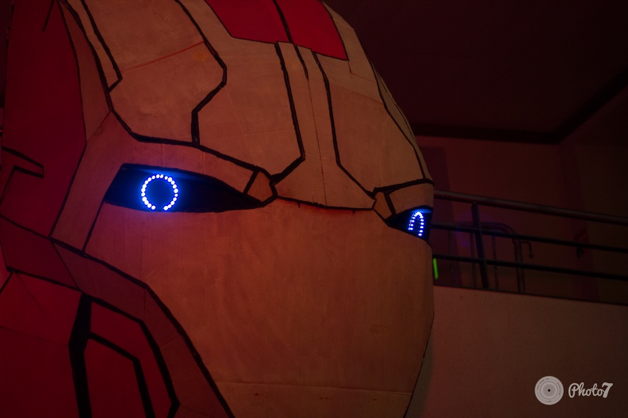

## Cardboard Iron Man face with glowing eyes, made for the *Hall Comics* party at ENSEEIHT

The different pieces have been designed by Clément Robert (standing on the right of the upper photo). Most of the assembly has been done by him, Guillaume Royer (on the left), and I.

The glowing eyes' brightness was saw-toothed and featured instant fade-in and slow fade-out. This was achieved by two oscillating transistors whose signal was amplified by a field-effect transistor after going through a one-way low-pass capacitive filter shortcut by a diode.

Here comes the BDA (*Bureau Des Arts*) team of the ENSEEIHT Students Association. They spent hours cutting out and painting the different parts of the structure after drawing those on large cardboard panels with the help of an overhead projector.

The last three photos were taken by [Photo7](https://www.bde.enseeiht.fr/clubs/photo/fiche/), the ENSEEIHT photography club. All rights on these belong to them.
