## Designed over the structure of a dead upright piano

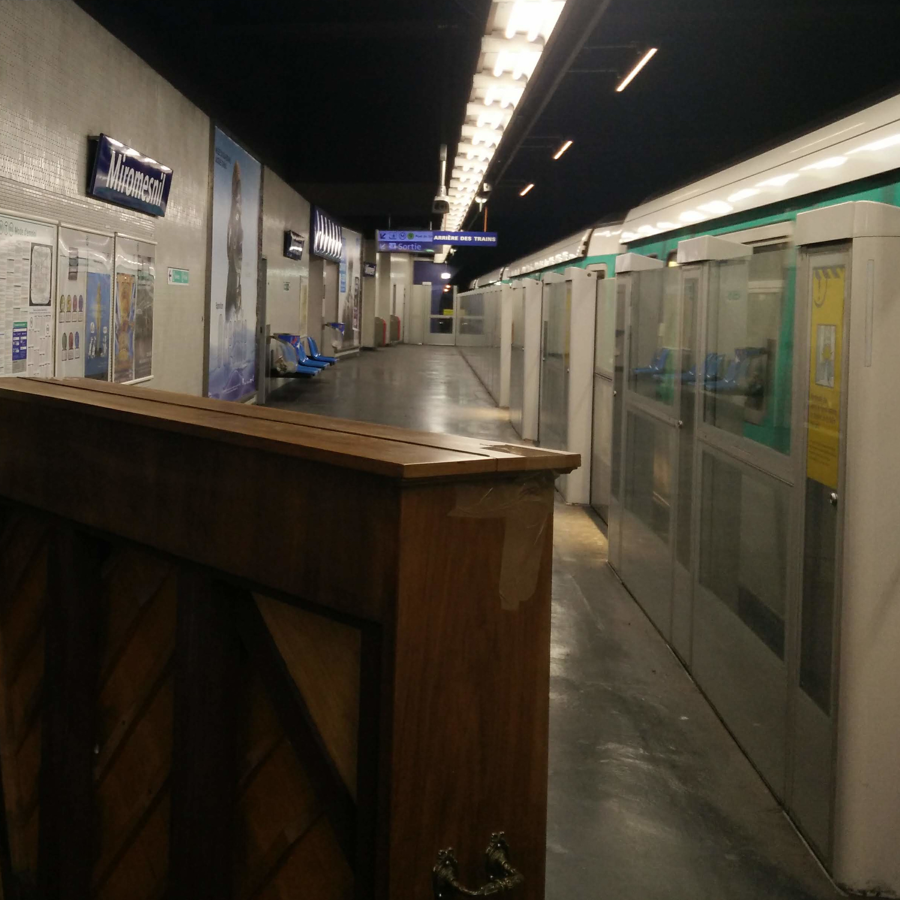

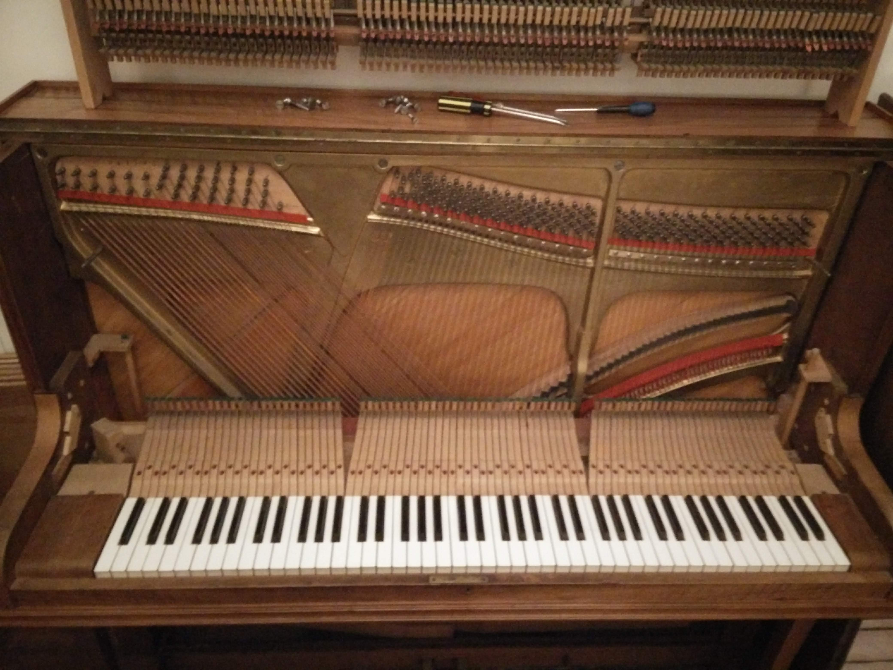

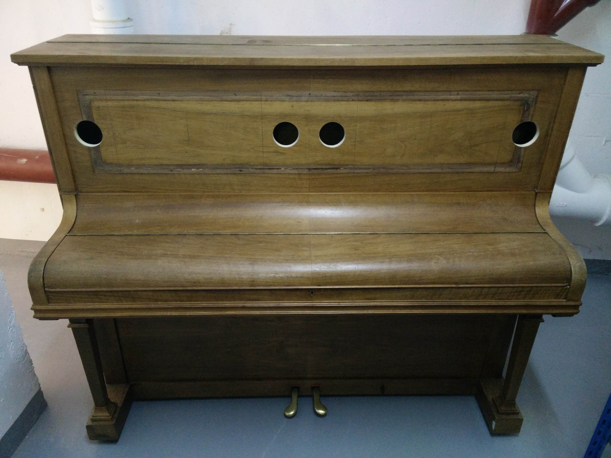

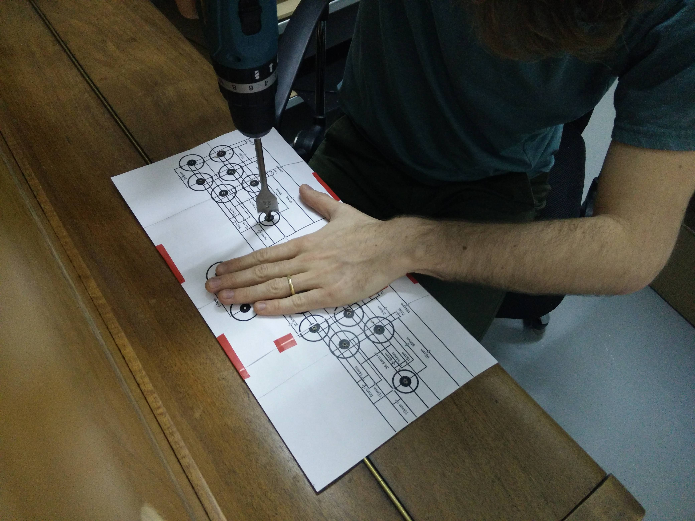

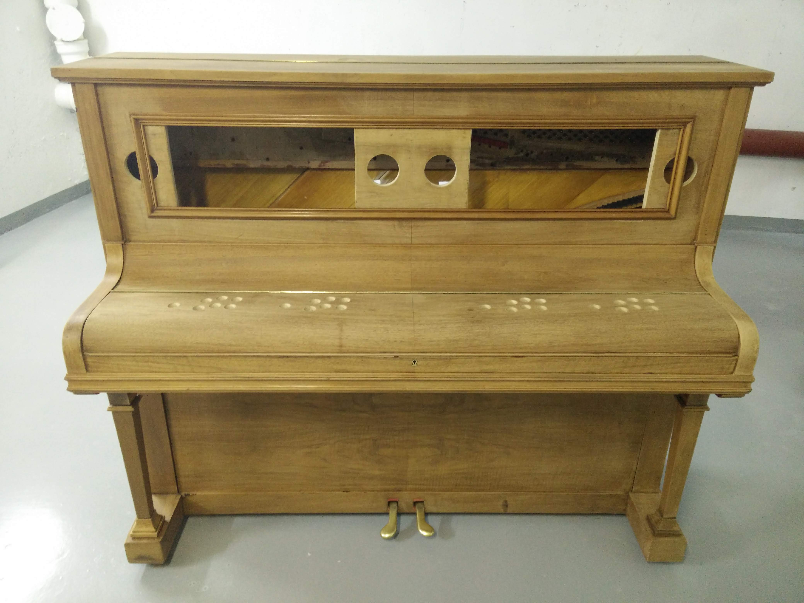

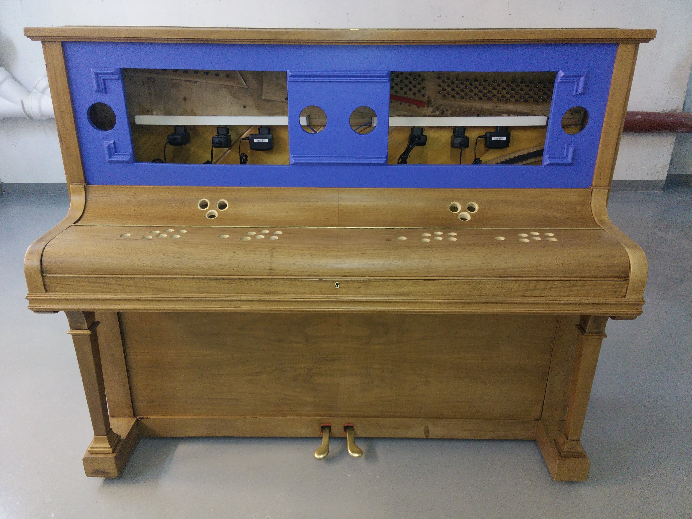

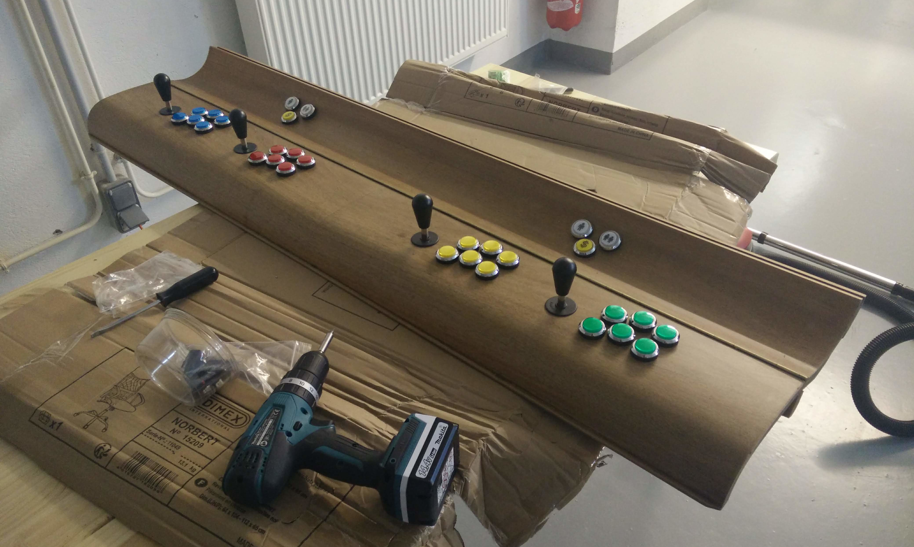

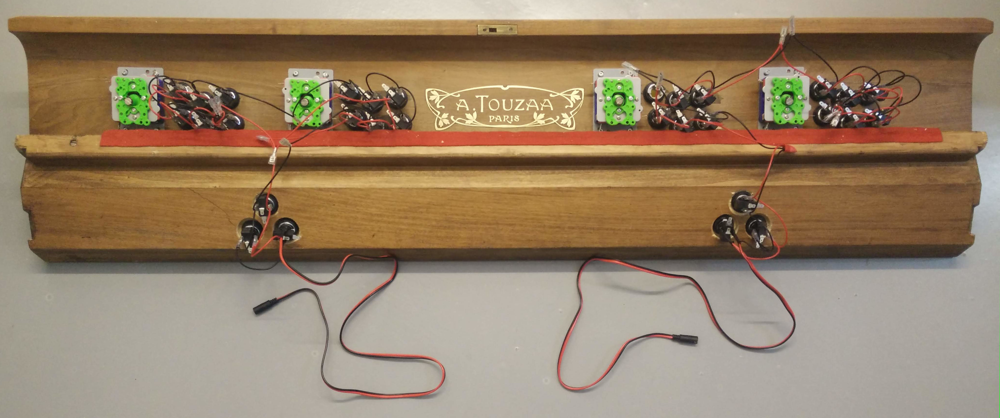

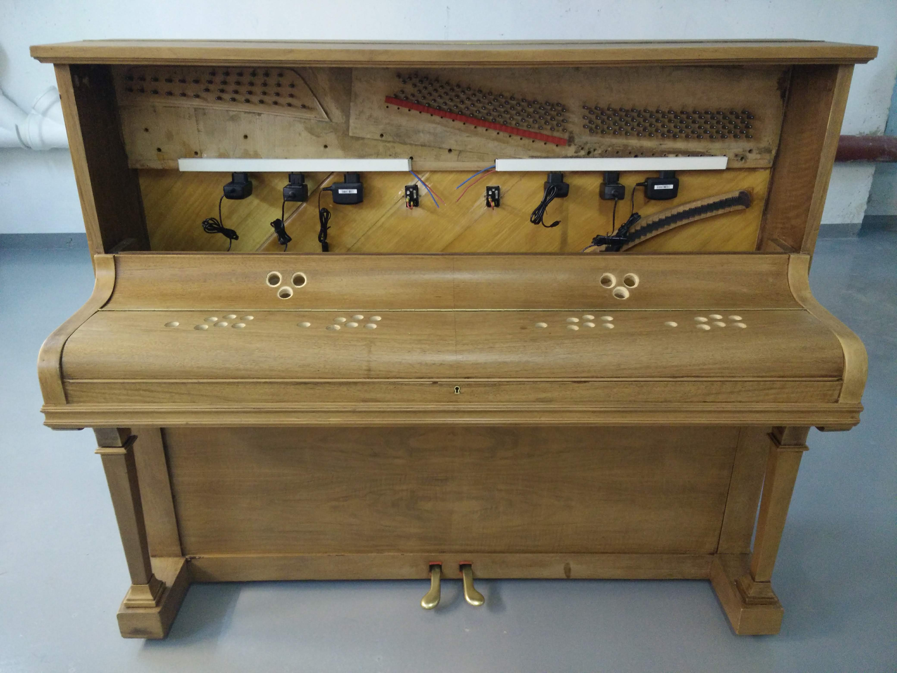

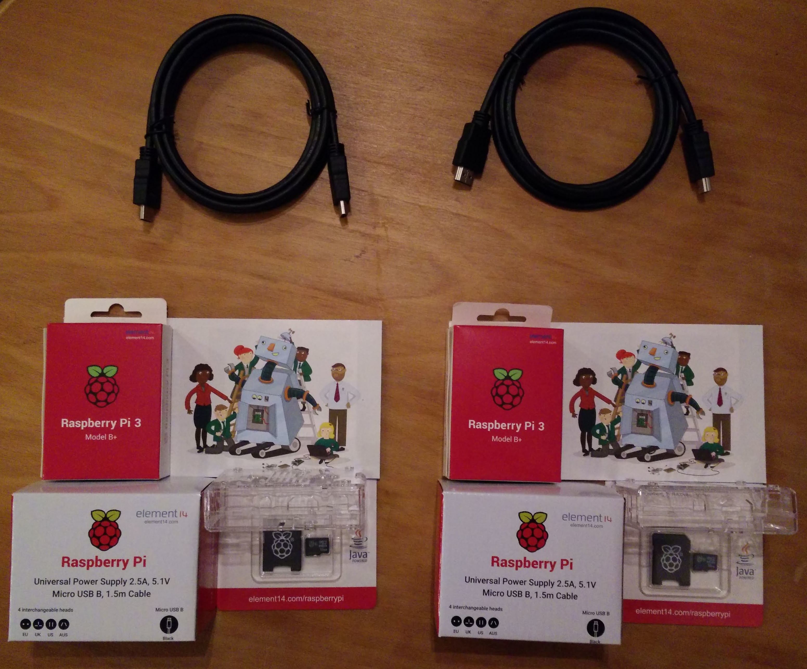

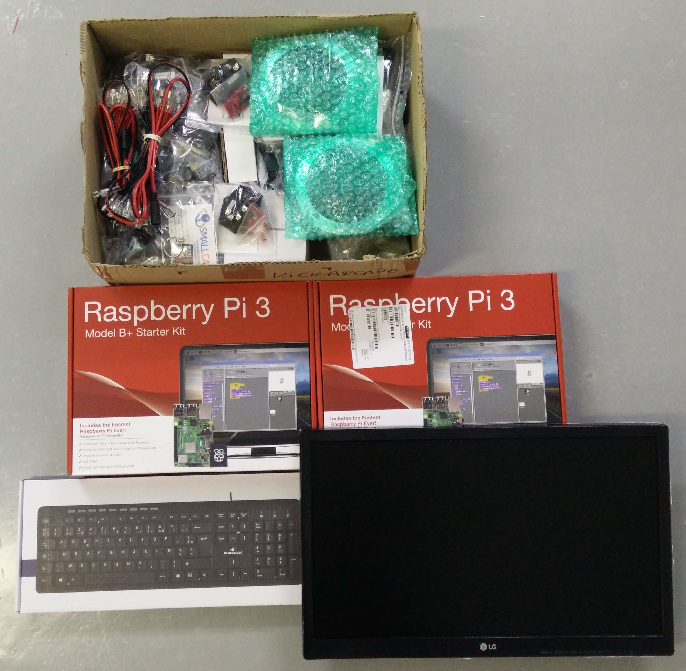

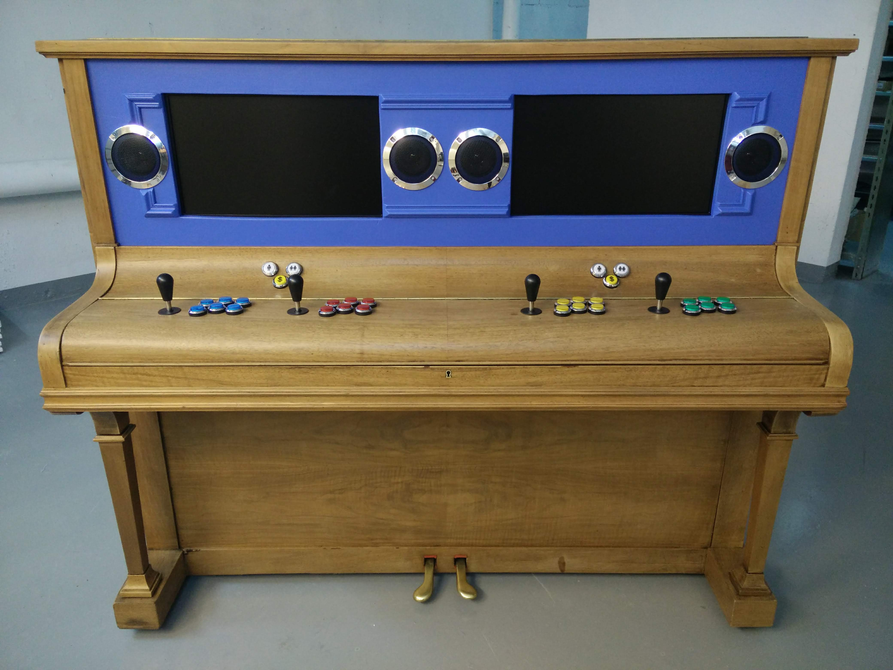

<video controls>
  <source src="/img/arcade/kickarcade/smoke_test.mp4" type="video/mp4" />
  Your browser does not support the video tag.
</video>

<video controls>
  <source src="/img/arcade/kickarcade/playing_doom.mp4" type="video/mp4" />
  Your browser does not support the video tag.
</video>

<video controls>
  <source src="/img/arcade/kickarcade/playing_smash_mkart.mp4" type="video/mp4" />
  Your browser does not support the video tag.
</video>

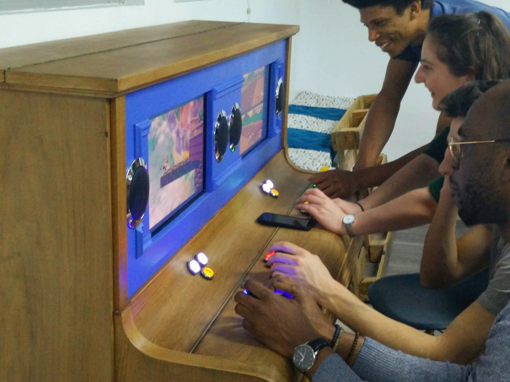